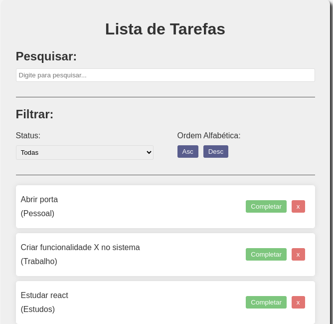
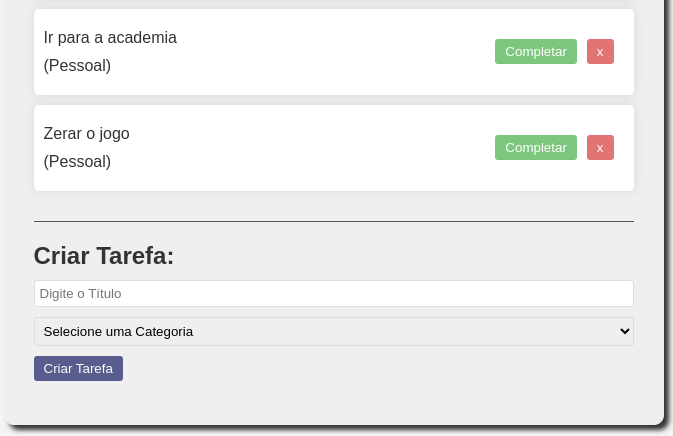
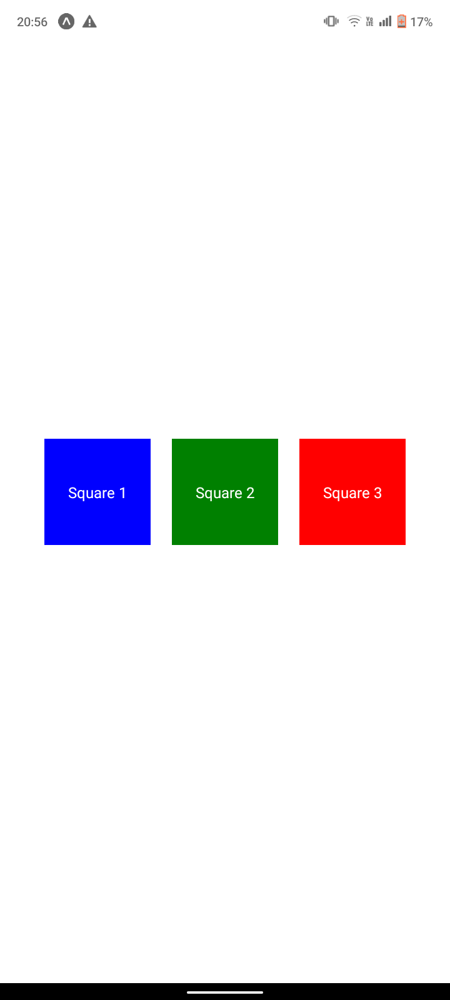
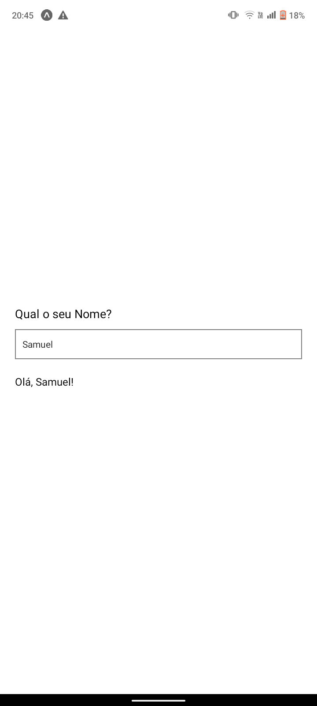
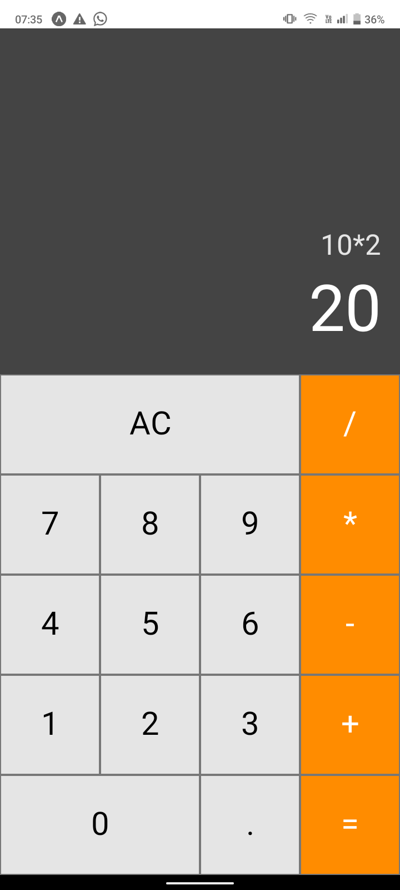
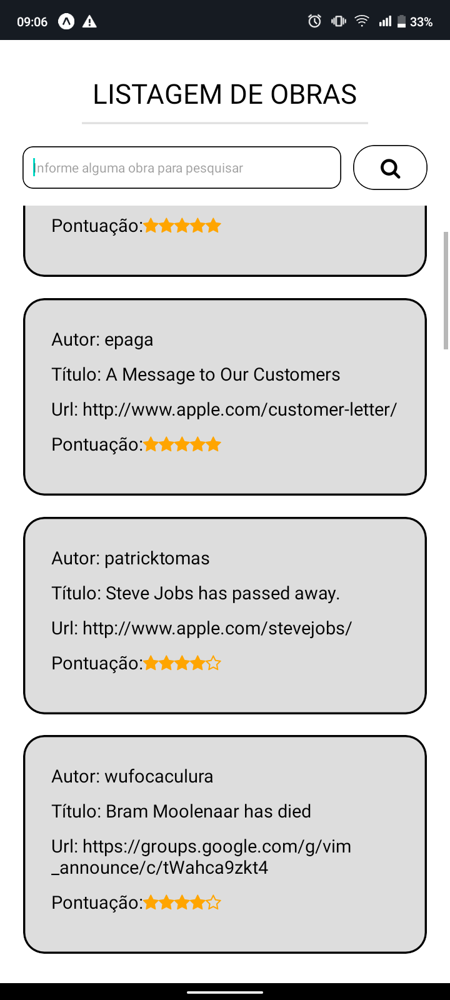
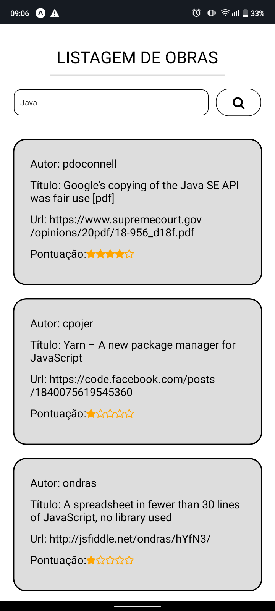
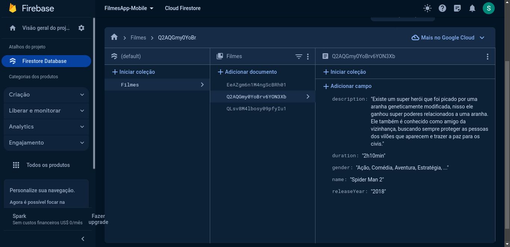

# Módulo I da Disciplina

## Questão 1 (Projeto React - To Do List)

Basicamente, um projeto para o usuário gerenciar suas tarefas diárias por meio da organização dos itens da lista de tarefas.

### Funcionalidades:
    - Usuário pode criar novas tarefas e adicionar na listagem
    - Usuário pode marcar tarefas como completas ou excluí-las
    - Usuário pode filtrar as tarefas por nome, também sendo elas completas ou não
    - Usuário pode organizá-las por ordem alfabética crescente ou decrescente

### Imagens da Aplicação:

- OBS: Foram necessárias duas imagens para mostrar a aplicação

## Questão 2 (Projeto React Native - Total de Cliques no Botão)

Um projeto inicial com o framework React Native que permite ao usuário saber quantas vezes ele pressionou um botão por meio de um campo textual.

## Questão 3 (Projeto React Native - Três Quadrados com uma Mensagem no Centro)

Uma aplicação/projeto usando também o framework React Native para criar três quadrados centralizados na tela do dispositivo com uma mensagem no centro de cada um.

## Questão 4 (Projeto React Native - Formulário de Input que Apresenta a Informação Digitada)

Uma aplicação feita com o framework React Native que pega o nome do usuário por meio de um input em um formulário básico para aprensentar uma mensagem inicial junto ao seu nome, logo abaixo dele.

## Questão 5 (Projeto React Native - Calculadora Básica)

Uma aplicação de uma calculadora construída por meio do framework React Native contendo apenas as operações básicas de soma, subtração, multiplicação e divisão.

# Módulo II da Disciplina

## Uma aplicação que realiza a busca de uma lista de livros (obras) e apresenta para os usuários.

## Características:
    - Apresenta uma listagem de livros com e sem filtragem, obtendo 20 obras e exibindo-as.
    - Exibe 4 informações sobre as obras, sendo elas autor, titulo, url e classificação. 

## Detalhes de Desenvolvimento:
    - A requisição GET para o Web Service foi realizada utilizando a bibiloteca 'axios'.
    - As informações da API foram buscadas e armazenadas em um array, sendo exibidos por meio do método 'map'.
    - A classificação das obras foi realizada por meio do campo 'points' dos dados da API, onde o valor foi dividido por 1000 para tê-lo na faixa de 0.0 e 10.0.
    - Foi necessário a criação de outro componente para abstrair e exibir cada livro que vinham da API individualmente.

## Imagens da Aplicação:

### Sem Filtragem

---

### Com Filtragem

# Módulo III da Disciplina (Trabalho Final)

Basicamente, trata-se de uma aplicação com CRUD (Create, Read, Update, Delete) de Filmes, onde o usuário vai poder fazer todas as operações necessárias com sua lista de filmes.

### Soluções Utilizadas:
    - Integração da aplicação com Firebase que é um Backend as a Service (BaSS), ou seja, fornece toda a utilização de serviços de Backend, como o uso de Banco de dados para armazenar as informações.
    - Navegação entre as telas por meio de React Native Navigation.
    - Não consegui utilizar Redux para gerenciamento global das informações da aplicação.
    - Design pensado e trabalhado por meio de estrutura de layout flex.

### Observações:
    - As funcionalidades de CRUD estão funcionando, mas ao apagar um filme da listagem a interface não mostra essa atualização, pois é necessário renderizar novamente a página - Infelizmente não consegui resolver esse problema.
    - As demais operações com as informações são mostradas na Interface sem nenhuma renderização ou ação a mais, sendo somente necessário realizar a operação em si.
    - O acesso a aplicação é: Email -> filmes@gmail.com | Senha -> filmes2023

### Pequeno gif da interface e imagem do firebase para apresentar a aplicação

#### Interface da Aplicação
Acesse o vídeo que mostra a interface pelo link do Google Drive:
[Interface](https://drive.google.com/drive/folders/1ncE0QC5FtO6xlSHgTnWsXOOauPl8LoAT)

#### Filmes no Firebase:

