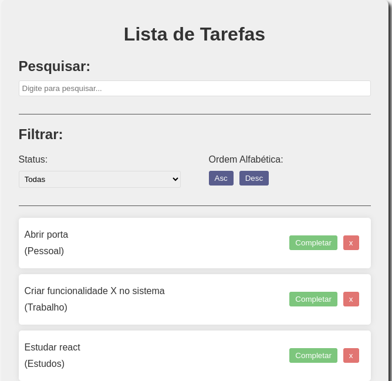
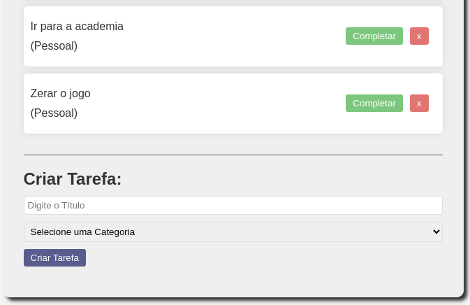
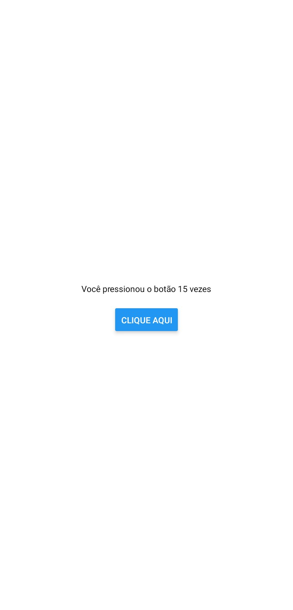
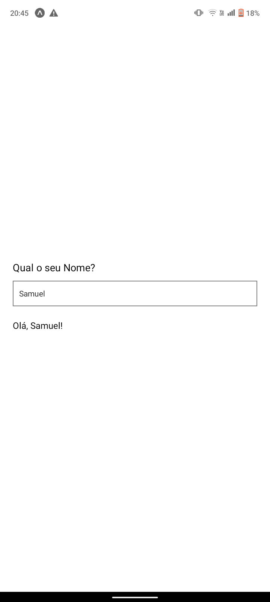

# Questão 1 (Projeto React - To Do List)

Basicamente, um projeto para o usuário gerenciar suas tarefas diárias por meio da organização dos itens da lista de tarefas.

## Funcionalidades:
    - Usuário pode criar novas tarefas e adicionar na listagem
    - Usuário pode marcar tarefas como completas ou excluí-las
    - Usuário pode filtrar as tarefas por nome, também sendo elas completas ou não
    - Usuário pode organizá-las por ordem alfabética crescente ou decrescente

## Imagens da Aplicação:

- OBS: Foram necessárias duas imagens para mostrar a aplicação

# Questão 2 (Projeto React Native - Total de Cliques no Botão)

Um projeto inicial com o framework React Native que permite ao usuário saber quantas vezes ele pressionou um botão por meio de um campo textual.

# Questão 3 (Projeto React Native - Três Quadrados com uma Mensagem no Centro)

Uma aplicação/projeto usando também o framework React Native para criar três quadrados centralizados na tela do dispositivo com uma mensagem no centro de cada um.

# Questão 4 (Projeto React Native - Formulário de Input que Apresenta a Informação Digitada)

Uma aplicação feita no framework React Native que pega o nome do usuário por meio de um input em um formulário básico para aprensentar uma mensagem inicial junto ao seu nome, logo abaixo dele.

# Questão 5 (Projeto React Native - Calculadora Básica)

Uma aplicação de uma calculadora construída por meio do framework React Native contendo apenas as operações básicas de soma, subtração, multiplicação e divisão.